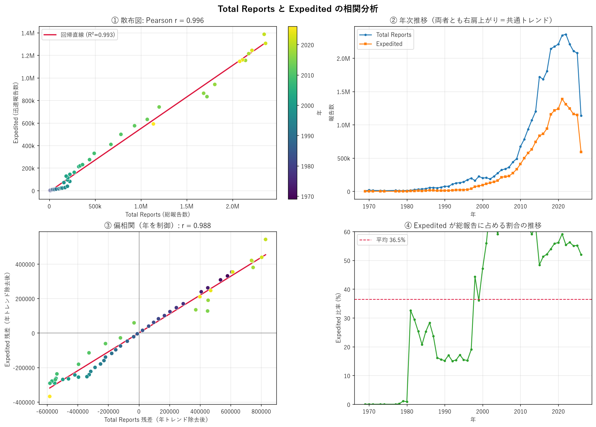
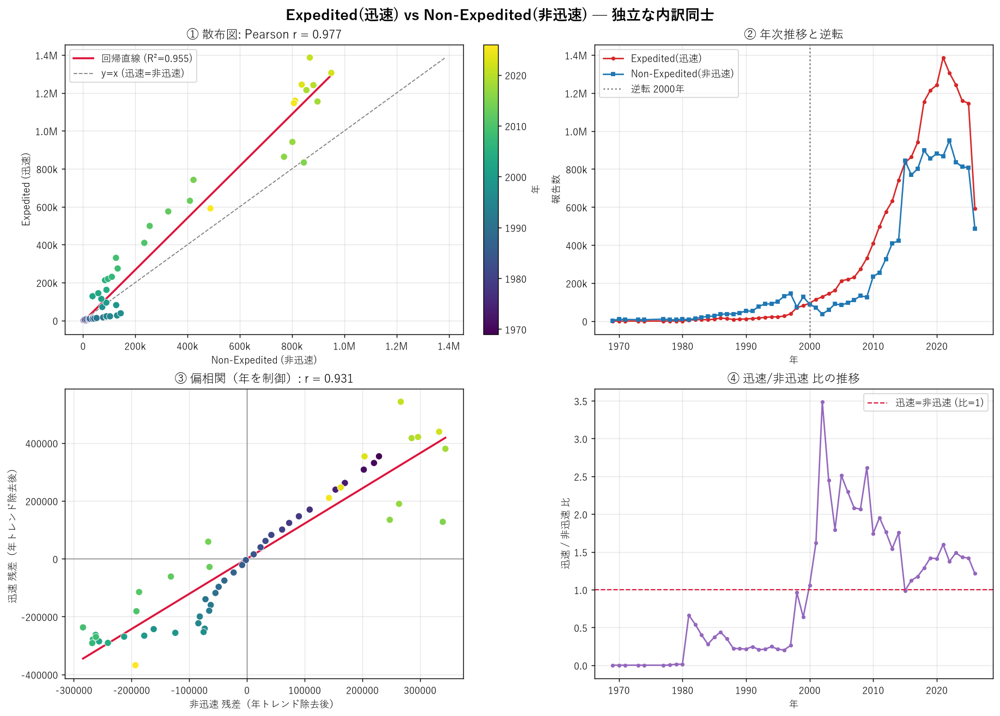
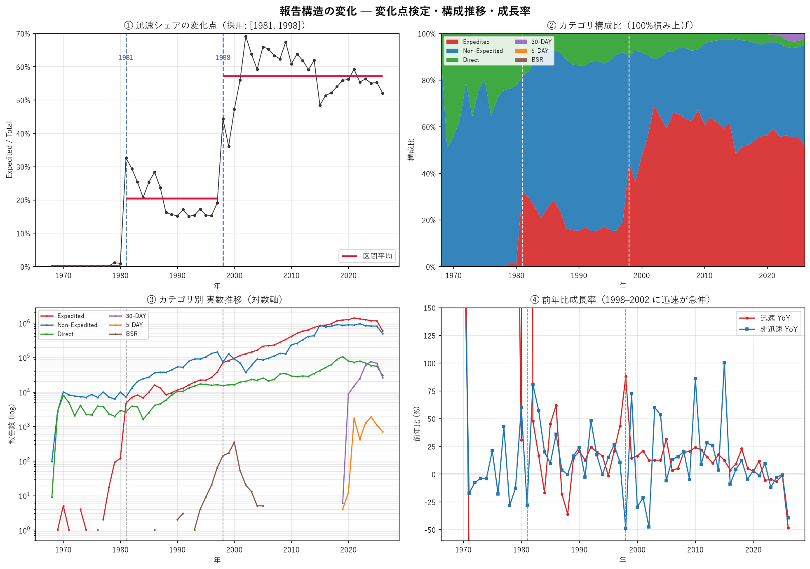

# FDA 有害事象報告データの相関・構造変化分析

米国 FDA の有害事象報告システム（FAERS）に寄せられた年次report件数を用い、
**report種別（迅速 / 非迅速など）の相関**と、その関係が**いつ・どう変化したか**を分析する。
相関の強さそのものより、「相関≠因果」を踏まえた**構造変化の特定**に主眼を置く。

> **Abstract (EN).** This project analyzes yearly counts of adverse-event reports
> from the U.S. FDA Adverse Event Reporting System (FAERS), 1969–2026. Starting
> from an observed strong positive correlation between *Total Reports* and
> *Expedited* reports, I show that this correlation is partly definitional
> (Expedited is a component of the total) and partly driven by a shared time
> trend. I then test two **independent** components — *Expedited* vs
> *Non-Expedited* — which still co-move after detrending (partial *r* = 0.93),
> pointing to **common underlying drivers rather than direct causation**.
> Finally, a dynamic-programming change-point analysis locates two structural
> breaks (**~1981 and ~1998**) after which expedited reporting rises from a
> negligible share to the majority of all reports. The main takeaway: on this
> dataset, *when and how the composition shifted* is far more informative than
> the headline correlation coefficient.

---

## TL;DR（3行）

1. Total×Expedited は r≈0.996 と極めて強いが、**Expedited は Total の構成要素**なので相関は半ば定義由来。
2. 独立な内訳同士（Expedited×Non-Expedited）でも年トレンド除去後に **偏相関 r≈0.93** ＝ 共通要因の存在を示唆（**因果ではない**）。
3. 迅速reportの割合には **1981年・1998年** の2つの構造変化があり、非迅速主体 → 迅速主体へ転換した。

---

## データ

| 項目 | 内容 |
|---|---|
| 出典 | 米国 FDA **FAERS Public Dashboard**（現 AEMS）— report種別×年 の受領件数 |
| 期間 | 1968–2026 年（**2026年は取得時点の暫定値=年途中**） |
| 粒度 | 年次の集計件数のみ（**個票・PII は含まない**） |
| ライセンス | 米国連邦政府の著作物 ＝ **パブリックドメイン**（コードは MIT） |
| ファイル | `data/raw/faers_reports_by_year.xlsx`（受領時のまま）／`data/processed/faers_by_year_clean.csv`（整形後・自動生成） |

**report種別の定義**（FDA の説明に基づく。詳細は出典を参照）:

- **Expedited（迅速 / 15-Day）** — 製造販売業者が提出。**重篤かつ予期しない**有害事象を短期間で報告するもの。
- **Non-Expedited（非迅速 / Periodic）** — 製造販売業者が**定期的に**まとめて提出する、迅速報告以外のもの。
- **Direct** — 医療従事者・患者・消費者が FDA へ**直接**提出したもの。
- **BSR / 30-DAY / 5-DAY** — 提出形式・区分の違い。BSR は電子提出の一形式、30-DAY/5-DAY は 2019年以降に出現する区分。

> ⚠️ **FDA の注意書き**: 「ある医薬品について有害事象報告が存在することは、その医薬品が有害事象を引き起こしたことを意味しない」。本データは件数の集計であり、**安全性の指標でも因果の証拠でもない**。本分析もこの前提に立つ。

---

## 再現手順

```bash
# 1. 依存関係（仮想環境推奨）
python -m pip install -r requirements.txt

# 2. 各分析を実行（figures/ に PNG、data/processed/ に整形CSV を生成）
python src/01_total_vs_expedited.py
python src/02_expedited_vs_nonexpedited.py
python src/03_structural_change.py
```

- パスは `src/common.py` がリポジトリ位置から相対解決するため、**どこから実行してもよい**。
- 日本語フォントは Windows / macOS / Linux の代表的な CJK フォントを自動探索する（`common.setup_japanese_font`）。

---

## 分析1: Total Reports と Expedited



- Pearson **r = 0.996**、Spearman ρ = 0.993 と極めて強い正の相関。
- ただし検算により `Total = Expedited + Non-Expedited + Direct + 30-DAY + 5-DAY + BSR` が **全55年で成立（残差0）**。
  → **Expedited は Total の構成要素**であり、この相関は**部分-全体による半ば定義的なもの**。
- 年トレンドを除いた偏相関でも r = 0.988。ただし上記のとおり「発見」としての価値は限定的。

**教訓**: 高い相関は部分-全体で簡単に出る。まず「その2変数は独立か」を疑う必要がある → 分析2へ。

---

## 分析2: Expedited と Non-Expedited（独立な内訳同士）



- 互いに独立な内訳（片方が他方を含まない）。Pearson **r = 0.977**。
- 年（時間トレンド）は両者を同時に押し上げる交絡。これを制御した **偏相関 r = 0.931**。
  → 「両方がただ経年で増えているだけ」では説明できず、**時間以外の共通要因**（例: 市場の薬剤数、監視体制、報告システム整備）が両者を同時に動かしている可能性を示す。
  → ただし**相関は因果ではない**。迅速↔非迅速の直接の因果か、第3の要因が両方を動かすのかは、このデータだけでは判別不能。
- 回帰の傾きは 1.37（≠1）で、**比率は一定でない**。件数ベースでは **2000年に迅速が非迅速を初めて逆転** → 構成が変わった → 分析3へ。

---

## 分析3: 構造変化の検出



迅速シェア（Expedited / Total）に対し、動的計画法によるピースワイズ定数分割（l2コスト）で変化点を検出した。

| 区間数 k | SSE | 検出された変化年 |
|---|---|---|
| 1 | 3.56 | — |
| 2 | 0.51 | **1998** |
| 3 | 0.21 | **1981, 1998** |
| 4–6 | 0.13→0.04 | +2001, +2015 …（微修正） |

SSE の減少はk=2→3で頭打ち（明確なエルボー）。**本質的な構造変化は 1981年 と 1998年 の2つ**と判断（2001・2015は細かい調整で、BIC単独だと過分割する点に注意）。

**3つの時代**（k=3 分割）:

| 期間 | 迅速シェア平均 | Total CAGR | 局面 |
|---|---|---|---|
| 1968–1980 | 0.2% | +49%/年 | 迅速報告がほぼ存在しない黎明期（低ベースからの急増） |
| 1981–1997 | 20.4% | +17.8%/年 | 迅速報告の制度化・非迅速優位 |
| 1998–2026 | 57.2% | +7.3%/年 | 迅速主体へ転換・成熟 |

- 新区分 **30-DAY / 5-DAY は 2019年に出現**（ごく最近の報告制度変更）、BSR は 2000年代前半に消滅。

---

## 考察

**なぜ迅速×非迅速の相関を調べたか。** 両者は見かけ上は独立な区分だが、Total Reports が年々増える中で、
背後に両者を同時に動かす何かがあるのではと考えた。

**相関から偏相関へ。** 実際に正の相関（r=0.98）が得られた。しかし両者とも経年で増加するため、
「年」という共通トレンドによる**疑似相関**を疑い、年を制御した偏相関を計算した。それでも
強い正の相関（r=0.93）が残った。これは時間以外の**共通要因**が両者を同時に動かしている可能性を示す。
ただし**相関は因果を意味しない**。ここで消せたのは「時間」という1つの交絡だけであり、
迅速↔非迅速が互いに影響し合うのか、第3の要因（薬剤数・利用者数の増加、監視強化など）が
両方を押し上げるのかは、このデータ単独では判別できない。**方向の特定は他データによる検証が必要**である。

**構造変化への接続。** 両者は連動するが、その**比率は一定でなかった**（回帰の傾き≠1、2000年の逆転）。
比率が動くとは、片方が他方より速く増減したということ。そこで「いつ比率が変わったか」を捉えるため
変化点分析に進んだ。

**構造変化の解釈。** 迅速シェアには 1981年・1998年 の2つの転換があった。ここで重要な区別がある。
「薬剤や利用者が増えて**両方の件数が増えた**」ことは、**実数（水準）の増加**は説明できても、
**割合（シェア）の上昇は説明できない**。もし共通要因が両者を同じ比率で押し上げたなら、
シェアは変わらないはずだからだ。シェアが 0.2%→20%→57% と上がったのは、
**迅速が非迅速より不釣り合いに速く増えた**ことを意味し、これには**迅速に固有の要因**——
最も有力には**迅速報告の義務化・報告基準の変更といった制度側の変化**——が必要になる。

**単一薬剤仮説の棄却。** 「ある薬の副作用が深刻で迅速報告が急増した」という仮説も考えられるが、
観察されたのは**約20年続く持続的な水準シフト**であり、単発の薬剤による一時的スパイクとは形が異なる。
よって単一薬剤要因は主因として考えにくく、制度・システム的要因を支持する。
（この仮説はデータで直接は検証していないが、「持続的シフト vs 一時的スパイク」という形状の違いから
反証的に評価できる。）

**結論。** 迅速報告は当初ほとんど使われていなかったが、1981年・1998年を境に Total に占める割合を
大きく高め、報告構造は非迅速主体から迅速主体へと転換した。その背景が制度変更なのか有害事象の
実態変化なのかの特定が、今後の分析課題である。

---

## 限界と注意（Limitations）

- **相関≠因果**: 偏相関で消せるのは制御した交絡（ここでは時間）のみ。因果の主張はしない。
- **2026年は暫定値**: 取得時点で年途中（前年比 ~55%）。近年の「減少」はこの不完全さで誇張される。トレンド判断時は 2026 を除外/暫定扱いにすること。
- **変化点のモデル選択**: l2コスト＋BIC は過分割しやすい。本分析は SSE のエルボー（k=3）で安定した2変化点を採用した。手法依存性がある。
- **区分定義の変遷**: 30-DAY/5-DAY の 2019年出現や BSR の消滅など、区分自体が時代で変わる。長期比較はこの点に留意。
- **集計データの限界**: 個票がないため、特定薬剤・疾患・重篤度による層別はできない。

---

## この分析で用いた技術

- **データ整形**: pandas による欠損(`-`)処理・集計行除外・型変換、整形結果の CSV 化
- **統計**: Pearson / Spearman 相関、**偏相関（残差法による交絡制御）**、単回帰
- **変化点検出**: 動的計画法によるピースワイズ定数分割（l2コスト）＋モデル選択（SSE / BIC）
- **可視化**: matplotlib（散布図・時系列・構成比の積み上げ・対数軸・前年比）、CJKフォント可搬化
- **再現性**: 相対パス設計（`pathlib`）、`requirements.txt`、環境非依存のフォント設定
- **解釈の規律**: 相関と因果の区別、部分-全体の交絡、水準と割合の区別

---

## 出典・ライセンス

- **データ**: U.S. FDA, *FAERS Public Dashboard*（現 AEMS）
  - FDA Adverse Event Reporting System (FAERS) Public Dashboard: https://www.fda.gov/drugs/fdas-adverse-event-reporting-system-faers/fda-adverse-event-reporting-system-faers-public-dashboard
  - 米国連邦政府の著作物のためパブリックドメイン。
- **コード**: MIT License（`LICENSE` 参照）。
